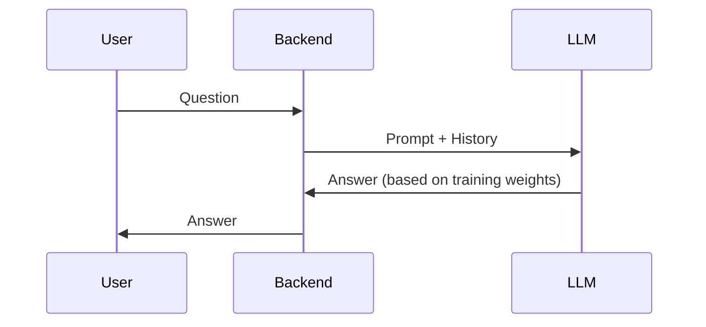
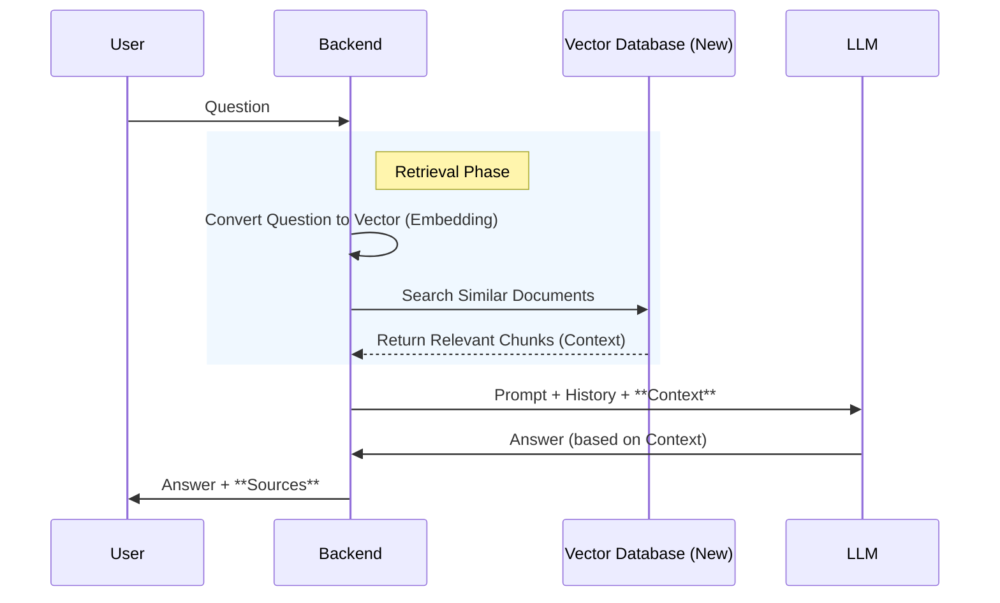

# RAG Implementation Plan

## Overview
Implementing **RAG (Retrieval-Augmented Generation)** changes your project from a "closed-book" exam (where the AI relies only on memory) to an "open-book" exam (where the AI can look up answers in a textbook).

## 1. Architectural Changes

### Current Flow (Simple LLM)


### New Flow (RAG)


## 2. New Components Required

### A. Vector Database (The "Long-term Memory")
We need a place to store your text data (PDFs, JSONs) in a format the AI can search mathematically.
*   **Tools:** `ChromaDB` (easiest, local file-based) or `FAISS`.
*   **Action:** Install `chromadb`.

### B. Embedding Model (The "Translator")
Converts text into lists of numbers (vectors) so we can compare meanings.
*   **Tools:** `sentence-transformers` (HuggingFace).
*   **Action:** Install `sentence-transformers`.

### C. Ingestion Script (The "Librarian")
A script to read your documents, chop them into small pieces (chunks), and save them to the Vector DB.
*   **Action:** Create `Backend/ingest.py`.

## 3. Codebase Impact

### [requirements.txt](file:///c:/Users/mrkeepout/Git/llm-projeto/requirements.txt)
**[ADD]**
```text
langchain
chromadb
sentence-transformers
pypdf (if using PDFs)
```

### [Backend/main.py](file:///c:/Users/mrkeepout/Git/llm-projeto/Backend/main.py)
**[MODIFY]**
1.  **Initialize Vector DB:** Load the database connection on startup.
2.  **Initialize Embedding Model:** Load the model that converts text to vectors.
3.  **Update [responder](file:///c:/Users/mrkeepout/Git/llm-projeto/Backend/main.py#136-256) function:**
    *   Before calling `model.generate`, take the user's `pergunta`.
    *   Query the Vector DB for the top 3-5 relevant chunks.
    *   Inject these chunks into the system prompt.

**Example Prompt Change:**
```python
# Old
prompt = f"Human: {question}"

# New
prompt = f"""Use the following context to answer the question:
{retrieved_chunks}

Human: {question}"""
```

### `Dataset/` Directory
**[USAGE CHANGE]**
*   Currently, you use [dataset_medquad.json](file:///c:/Users/mrkeepout/Git/llm-projeto/Dataset/dataset_medquad.json) for *fine-tuning* (teaching the model how to speak).
*   With RAG, you would also use this (or raw PDFs/Docs) as your **Knowledge Base**. You don't necessarily need to train the model on it; you just need to put it in the database.

## 4. Pros & Cons

| Feature | Current (Fine-Tuning) | With RAG |
| :--- | :--- | :--- |
| **Knowledge Source** | Static (what it learned during training) | Dynamic (whatever is in the DB) |
| **Updates** | Hard (Re-train model ~1 hour) | Easy (Add file to DB ~10 seconds) |
| **Hallucinations** | Higher risk | Lower (grounded in context) |
| **Complexity** | Medium | High (needs DB management) |
| **Speed** | Fast | Slightly Slower (retrieval step) |

## Recommendation
Since you already have a fine-tuned model, **adding RAG is the best next step**. It allows your "Health Assistant" to quote specific protocols, laws, or recent papers that weren't in the training set.
